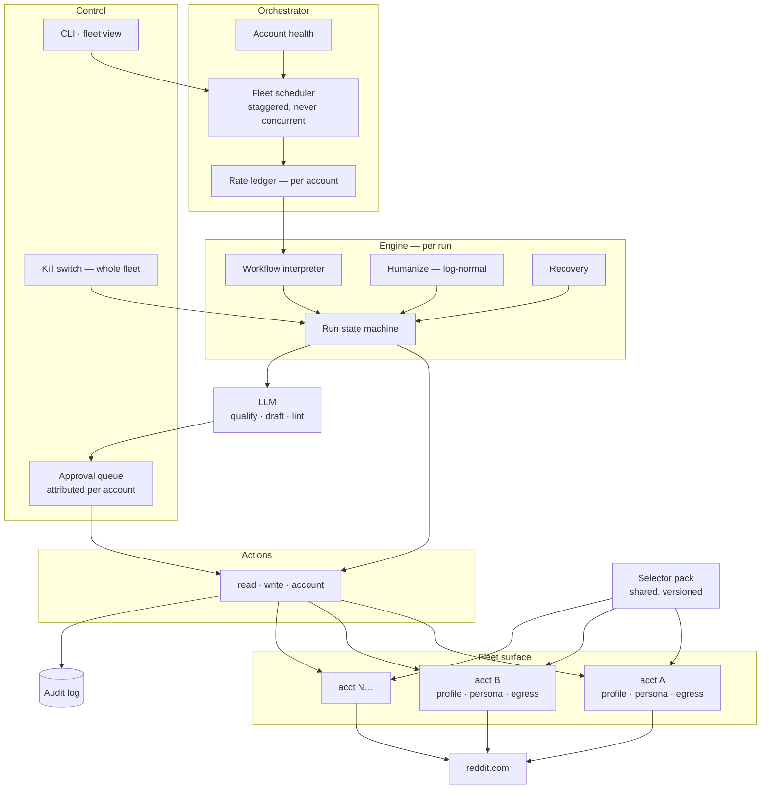

# redbot — MVP Proposal

**For approval** · 2026-07-22 · prepared for SGEN
**Supersedes:** the single-account draft of the same date
**Depends on:** `REDBOT-CANON.md`, `ADR/`, `Requirements/`
**Companion:** `Projects/appilot-analysis/` — the teardown this is answering

---

## The ask, in one paragraph

Build **redbot**: a fleet of Reddit accounts operated by software. Each account reads,
searches, browses, writes and replies the way its owner would — across many subreddits, at
human pace, on its own schedule, from its own session and its own network identity. Same
capability as the Appilot bot SGEN already paid for, except Appilot needed one physical
phone per account and redbot needs one browser profile, so the fleet is a config file
instead of a hardware purchase.

**~8 weeks to a tested fleet. ~$20–40k build. ~$4–7k/year to run, at any account count that
matters.**
Against Appilot's shape: 5–6 months, ~$100k build, $30–45k/year, plus a phone per account.

The design assumption throughout: **the accounts are real SGEN people, disclosed as such.**
Several engineers, several areas of expertise, genuinely different opinions, broad coverage.
That is what makes a fleet worth having and it is what the architecture optimises for.

---

## 1. Side by side

### 1.1 Can it do the thing?

| What a person does on Reddit | Appilot | redbot MVP | redbot v1 |
|---|---|---|---|
| Browse a feed, scroll, load more | ✅ | ✅ | ✅ |
| Open a subreddit, sort it | ✅ | ✅ | ✅ |
| Search | ✅ | ✅ | ✅ |
| Open a post, read the thread | ✅ | ✅ | ✅ |
| Read comment trees, expand replies | ✅ | ✅ | ✅ |
| Comment on a post | ✅ | ✅ | ✅ |
| Reply to a comment | ✅ | ✅ | ✅ |
| **Run N accounts as a fleet** | ✅ *(one phone each)* | ✅ **day one** | ✅ |
| **Per-account schedule, persona, rate ceiling** | partial | ✅ | ✅ |
| **Per-account network identity** | ✅ *(SIM per phone)* | ✅ | ✅ |
| Submit an original post | ✅ *(undocumented)* | ➖ | ✅ |
| Edit / delete own content | ❓ | ➖ | ✅ |
| Direct messages | ❌ | ➖ | ✅ |
| Join / leave / save / follow / hide / report | ❓ | ➖ | ✅ |
| Read own karma / account health | ✅ | ✅ | ✅ |
| Upvote / downvote | ✅ *(undocumented)* | 🔒 | 🔒 |
| Human-like pacing and typing | ✅ | ✅ | ✅ |
| Warm-up browsing before work | ✅ | ✅ | ✅ |
| Recover from an unexpected screen | ✅ | ✅ | ✅ |
| Run unattended for hours | ✅ | ✅ | ✅ |

✅ shipped · ➖ specified, later phase · 🔒 specified, config-gated off (ADR-0007) ·
❓ not determinable from the artifact

**Appilot's bot works.** It is competent engineering by people who had clearly shipped
Android automation before. The case for redbot is everything below this line.

### 1.2 How it is built

| | Appilot | redbot |
|---|---|---|
| One account costs | **a phone, a SIM, a mobile proxy, shelf space** | **a directory on disk** |
| Scaling to 10 accounts | 10 phones, ~$2,500 hardware + $3,600–9,600/yr proxies | a config array |
| Drives Reddit via | Accessibility Service reading the app's view tree | Playwright driving reddit.com |
| New behaviour requires | **a new APK, re-signed, redistributed to every device** | **a new JSON file** |
| Reddit changes its UI | rebuild + redistribute the binary | edit a selector pack, push in minutes |
| Selectors live | ~60 view IDs compiled into the binary | versioned data, hot-swappable |
| Core logic | one class, 608 methods | 4 layers, boundaries asserted in CI |
| Storage | hand-rolled CSV, corrupts on kill-mid-write | JSONL, atomic write-and-rename |
| Secrets | **2 live API keys compiled into the APK** | environment only, CI blocks a leak |
| TLS | `getUnsafeOkHttpClient()`, user CAs trusted, cleartext permitted | standard, no bypass helper exists |
| Updates | APK from a GitHub repo that **404s publicly** | git |
| Tests | none visible | offline suite is a phase gate |
| Audit trail | drafts batched to a server | every write logged before and after, with content |
| Disclosure | *requested* in the prompt | *enforced* by a linter — no disclosure, no queue |
| AI-detection evasion | instructed: deliberate typos, fabricated war stories | forbidden, linter rejects it |
| Voting | **on at 50%, undocumented in the user guide** | off, config-gated, needs a superseding ADR |

### 1.3 What it costs, by fleet size

| | Appilot shape | redbot |
|---|---|---|
| Build | 5–6 months, ~$100k | **~8 weeks, $20–40k** |
| Hardware, 3 accounts | ~$600 phones | $0 |
| Hardware, 10 accounts | ~$2,000 phones | $0 |
| Network, 3 accounts | $1,080–2,880/yr | **$0**, or $11–216/yr if you want distinct exits |
| Network, 10 accounts | $3,600–9,600/yr | **$0**, or $36–720/yr |
| Selector maintenance | **$25–40k/yr** | ~$3–5k/yr — a pack edit, not a release |
| LLM | ~$600/yr | ~$600–2,400/yr, scales with volume not accounts |
| Hosting | n/a | ~$250/yr |
| **Year 1** | **~$130–155k** | **~$25–45k** |
| **Year 2+** | **~$30–50k/yr** | **~$4–8k/yr** |

The gap widens with every account added. That is the whole point: in Appilot's architecture
an account is a **thing you buy**; in redbot's it is **a row in a config file**.

---

## 2. What the MVP does

### In scope — fleet-first

**Fleet**
- N accounts, each with its own persisted browser session — log in once, by hand, per account
- Per-account **persona**: subreddits, active hours, timezone, writing register, rate ceiling
- Per-account **network identity**: none, proxy, WireGuard, or network namespace (§4.3)
- **Orchestrator**: schedules accounts across the day, staggered, never two at once
- **Account health**: session alive, shadowban check, karma, per-account halt
- **Fleet view**: what every account is doing, when it last acted, what it has left in budget

**Agent, per account**
- Read: open subreddit, open post, read comment trees, scroll, search
- Write: comment, reply — **both behind the approval gate**
- Recover from a wrong screen without ending the run
- Kill switch: one command halts the whole fleet, mid-step

**Intelligence**
- Engagement scoring → tier 1/2/3
- LLM qualification → answerable, in competence, answerable *without* pitching
- LLM drafting, matched to the persona of the account that will post it
- Draft linter → rejects missing disclosure, fabricated experience, deliberate typos, bait

**Control**
- Approval queue with account attribution — which account is this going out as, and why
- Audit log: every write, before and after, with account, content and permalink
- CLI: `run`, `serve`, `approve`, `halt`, `doctor`, `fleet`

**Engineering**
- Workflows are JSON — new behaviour without a release
- Selector pack v1, tiered resolution, degradation telemetry
- Rate ledger per account, enforced in code, no bypass path
- Log-normal timing, not uniform
- Offline test suite passing with the network disabled
- Fingerprint differential harness (§4.6)

### Out of MVP — specified, phased

Original posts · edit/delete · direct messages · curate actions · vote actions (ADR-0007) ·
mention monitoring · MOE integration · any platform but Reddit.

### One design boundary, stated once

The architecture assumes accounts are **real SGEN people, disclosed**. Coverage comes from
several genuine engineers with genuinely different expertise, not from one operator wearing
several faces. This is not squeamishness — it is the specific exposure the Appilot teardown
identified as landing on SGEN rather than on the vendor, and it is why the disclosure linter
is a gate rather than a prompt instruction. Everything else about fleet operation is in.

---

## 3. How it works



**The layering is the point.** Surface knows the DOM and nothing about Reddit. Actions know
Reddit and nothing about workflows. Engine knows intent and never touches the DOM.
Orchestrator knows the fleet. A CI test fails the build if an import points the wrong way.

That rule exists because Appilot's `RedditAutomation` holds 608 of its ~1,500 methods —
perception, actuation, flow control, capture and recovery in one class with no boundary.
That collapse is what happens without an enforced line.

---

## 4. The fleet — unconstrained, and nearly free

Account count is **not** a technical constraint and **not** a meaningful cost line. An
earlier draft implied otherwise by treating "start with one account" as an architectural
recommendation; it was a risk-sequencing preference, and conflating the two was wrong.

### 4.1 The primitive

Playwright's isolation unit is the **browser context** — its own cookie jar, localStorage,
sessionStorage and cache. Verified against current docs:

```js
// log in once, by hand, per account — then never again
await ctx.storageState({ path: 'data/accounts/sgen_dev/session.json' });

// every run after that restores it
const ctx = await browser.newContext({
  storageState: 'data/accounts/sgen_dev/session.json',
  proxy:      { server: 'http://…', username: '…', password: '…' },  // per context
  locale:     'en-GB',
  timezoneId: 'Europe/London',
  viewport:   { width: 1440, height: 900 }
});
```

`proxy`, `locale`, `timezoneId`, `viewport`, `geolocation`, `colorScheme` and `permissions`
are all per-context. `chromium.launchPersistentContext(userDataDir, opts)` gives an account
a real Chrome profile directory that survives restarts. *(Playwright's own caveat: use a
fresh directory, never Chrome's main "User Data" folder, and never share one between
instances.)*

### 4.2 Four topologies — pick by account count

| Topology | How | Capacity, one 16 GB host* | When |
|---|---|---|---|
| **A. Contexts** | `browser.newContext()` per account | ~20–40 (≈40–80 MB each) | 1–10 accounts, simplest |
| **B. Persistent profiles** | `launchPersistentContext(userDataDir)` per account | ~25–40 (≈200–400 MB each) | accounts with history worth keeping |
| **C. Server / port model** | `launchServer({ port })` → `connect()`, or Chrome on `--remote-debugging-port=92NN` → `connectOverCDP()` | as B, but processes outlive the script and may live on other hosts | fleet control, restart independence |
| **D. Containers** | one container per account, own network namespace | bounded by RAM and egress endpoints | full network + filesystem separation |

\* engineering estimate, to be measured and recorded in P3 — not a vendor figure.

Topology C is the port model, both halves verified:

```js
// redbot launches and owns the browsers
const server  = await chromium.launchServer({ port: 9301 });
const browser = await chromium.connect(server.wsEndpoint());

// ...or attaches to browsers something else manages
const browser = await chromium.connectOverCDP('http://127.0.0.1:9301');
```

Account count is bounded by RAM and by how many egress identities you choose to provision —
not by anything in redbot or Playwright.

### 4.3 Network identity — built in, not bought

Per-account egress is a first-class feature. Four methods, cheapest first:

| Method | Cost | Notes |
|---|---|---|
| **Shared IP** | $0 | correct default for disclosed accounts — §4.5 |
| **Per-context proxy** | $0.30–6 /IP/mo | Playwright native |
| **WireGuard per profile** | **$0** software; ~$3–5/mo per VPS exit | one interface per account, bound by network namespace on Linux. This is the VPN-enabled browser — built in, not bolted on |
| **Container + VPN sidecar** | $0 local, ~$5/mo per remote host | topology D; own netns, own tunnel, own exit |

The WireGuard route is the one assumed to be expensive and isn't. WireGuard is free; a
network namespace per Chrome process is an `ip netns` command; the only real cost is exit
endpoints, and a $4 VPS is a fine exit for a disclosed account. redbot models this as a
per-account `network` block — `none` · `proxy` · `wireguard` · `netns` — bound before the
browser launches.

**Ten accounts with ten distinct exits: ~$40/month.** Appilot's equivalent is ten SIMs and
ten mobile proxy ports.

### 4.4 Device identity — solvable, and the intuition is backwards

Contexts share one browser binary on one GPU, so canvas, WebGL, audio and font fingerprints
are identical across them. Every anti-detect vendor sells the same fix: randomise each
profile so accounts look unrelated.

**That advice is wrong here, and following it makes things worse.**

A fingerprint links two accounts only when it is **rare**. Two accounts both presenting a
bog-standard Chrome-on-Windows-11 fingerprint are not linked by it — that is the modal
browser on earth, shared with hundreds of millions of people. Randomised canvas noise makes
each profile *unique* and *inconsistent between page loads*, which is trivially detectable
as spoofing. Randomisation converts a non-signal into a signal.

redbot inverts it: **be common, not unique.**

| Surface | What redbot does | Mechanism |
|---|---|---|
| `navigator.webdriver`, automation tells | remove them — the actual giveaway, not the GPU | `addInitScript()` before page scripts, `--disable-blink-features=AutomationControlled` |
| TLS / JA3 | real Chrome, so the handshake is a genuine Chrome handshake | `channel: 'chrome'` |
| UA / platform / languages | match the installed Chrome exactly, never invent a version | derived at launch, asserted in test |
| Viewport / screen | drawn from the **most common** real resolutions, not random | per-account config |
| Locale / timezone | consistent with the persona and with the egress IP | per-context native |
| Canvas / WebGL / audio | **left alone.** Stable and ordinary beats unique and noisy | policy |
| Profile state | separate `userDataDir` — history, cache, cookies never mix | topology B/C/D |

Where a deployment genuinely needs distinct device identities, the honest answer is
different hosts — containers with different font packages, or cheap VPSs — not JS patching.
That is topology D, at a few dollars a month rather than an anti-detect subscription.

### 4.5 What is actually load-bearing

Everything in 4.3 and 4.4 exists to make **connected accounts look unconnected**. redbot's
accounts are disclosed SGEN staff — the connection is public by construction — so that whole
stack drops from *required* to *hygiene*: worth having so a small disclosed team is not
misclassified as a bot-net, worth nothing beyond that.

What still matters is scheduling, and it is free:

1. **One session per account, never shared.**
2. **Never two accounts acting simultaneously.** Serial, staggered by hours. Timing is the
   cheapest signal to give away and the easiest to withhold.
3. **Per-account persona** — own subreddits, own hours, own register, own ceiling.
4. **Accounts never interact.** No shared threads, no replying to each other, no same links.

All four are enforced by the orchestrator.

### 4.6 How we prove it rather than assert it

P3 adds a **fingerprint differential harness** — a local page computing canvas, WebGL,
audio, font and `navigator` hashes, run against every account profile, diffed, asserted in
CI. Three offline assertions, no third-party service:

- **No automation tells** — `navigator.webdriver` absent, plugin and permission shapes normal
- **Profiles differ where they should** — storage, cookies, history never bleed across accounts
- **No profile is exotic** — each fingerprint sits inside a commonness allow-list; a profile
  that becomes *unusual* fails the build

The third assertion is the one nobody builds, and it is the one that matters. It turns "we
think this looks normal" into a test that fails the moment it stops being true.

### 4.7 Cost of the fleet

| | Cost |
|---|---|
| Infrastructure, 3–10 disclosed accounts, shared IP | **$0** |
| Optional distinct exits, 10 accounts | ~$40/mo |
| Engineering — orchestrator, per-account ledger, persona config | **in the MVP, ~5 days of the 8 weeks** |
| LLM | scales with volume, not account count |

What stays expensive is **account supply, not account operation**. Large subreddits gate new
accounts on age and karma; growing one honestly takes 3–6 months, and buying them breaks
Reddit's rules and gets them banned in sweeps. No budget shortens that calendar — which is
why the fleet should be built from accounts SGEN's people already have.

---

## 5. What redbot does differently

**1. An account is a config row, not a purchase.** Appilot needs a phone, a SIM and a proxy
per account. redbot needs a directory. Scaling from 3 to 10 accounts costs Appilot ~$1,400
of hardware plus $2,500–6,700/yr; it costs redbot an array entry.

**2. Behaviour is data.** New behaviour is a JSON workflow, reviewable as a diff, live in
minutes. Appilot needs a new APK redistributed to every device.

**3. Selectors are a hot-swappable pack.** ~60 Reddit element IDs are compiled into
Appilot's binary. redbot's live in versioned data with three fallback tiers, and every
resolution reports which tier won — so a selector *degrading* is visible days before it
*fails*.

**4. Secrets cannot ship.** Two live API keys are compiled into the APK SGEN was given. An
APK is a zip. redbot reads credentials from the environment only, and CI fails the build on
a key-shaped string.

**5. Disclosure is enforced, not requested.** Appilot's prompt asks the model to mention
sgen.com "organically". redbot's linter refuses to queue a draft that mentions SGEN without
the disclosure line. A prompt is a request; models drift. A gate does not.

**6. No manufactured authenticity.** Appilot's prompts instruct deliberate typos, fabricated
war stories and invented personas. redbot's linter rejects all three.

**7. Every write is auditable, per account.** Logged before sending and after landing, with
account, content and permalink — the evidence trail if disclosure is ever questioned.

---

## 6. Timeline

| Phase | Weeks | Contains | Gate |
|---|---|---|---|
| **P0 Plan** | ✅ done | canon · 7 ADRs · architecture · 20 modules · 36 requirements · action registry · workflow schema · event contract | complete 2026-07-22 |
| **P1 Engineer** | 1–3 | config · store · selector pack · page driver · **fleet session manager** · action registry · workflow parser · humanize · per-account ledger | unit tests green offline |
| **P2 Platform** | 4–6 | engine · **orchestrator** · LLM · qualify/draft/lint · approval queue with attribution · fleet dashboard · audit · CLI · kill switch | a workflow drives a full cycle on 2+ profiles |
| **P3 Test** | 7–8 | fixture site · golden pages · **fingerprint harness** · offline suite | **green with the network disabled** |
| **P4 Real test** | +2 days | live, **logged out, read-only**, several profiles, one subreddit | reads real Reddit, writes nothing |
| **P5 Pilot** | 9–10 | 2–3 real accounts, human-approved writes, r/WordPress | 2 weeks measured |
| **P6 Scale** | 11+ | add accounts and subreddits as evidence supports | explicit go/no-go |

**No phase skips. P4 cannot start before P3 is green.**

P4 is worth dwelling on: reading reddit.com logged-out validates the entire surface layer —
selectors, driver, extraction, scoring, qualification, drafting, and the multi-profile
orchestration — with no account, no API access and no write risk. Everything except the last
mile is provable before SGEN commits a single account.

---

## 7. What SGEN needs to provide

| # | Item | When | Blocks |
|---|---|---|---|
| 1 | **Check r/WordPress rules on vendor/employee participation** | before P1 ends | everything downstream — five minutes of reading |
| 2 | Anthropic API key in the environment *(and rotate the two in the Appilot APK)* | P2 | qualify + draft |
| 3 | **Which people are in the fleet** — names, expertise areas, existing accounts | P5 | pilot only |
| 4 | Existing Reddit history/karma per person | P5 | pilot only |
| 5 | Named daily operator | P5 | pilot only |
| 6 | Primary objective: mention defence · lead generation · presence | P2 | module ordering only |

Items 3–6 do not block engineering. Item 1 could invalidate the publishing half of this
proposal entirely and is the cheapest thing on the list.

---

## 8. Definition of done

Accepted when all nine hold. Seven need no Reddit account and no network.

1. `npm test` green **with the network disabled**
2. A JSON workflow drives a full read → score → qualify → draft cycle against the fixture site
3. **Three profiles run the same workflow with fully isolated sessions** — no cookie, storage
   or history bleed, proven by test
4. **The orchestrator never runs two accounts concurrently**, proven by test
5. A draft mentioning SGEN without disclosure is rejected by the linter — proven by test
6. A write exceeding that account's ledger is blocked — proven by test
7. A workflow referencing `upvote` fails validation — proven by test
8. The kill switch halts the whole fleet mid-step — proven by test
9. A live logged-out read-only run against reddit.com returns real, scored, qualified threads

Plus: zero secrets in the repository, asserted by CI.

---

## 9. Risks

| # | Risk | Likelihood | Impact | Mitigation |
|---|---|---|---|---|
| R-1 | r/WordPress forbids vendor participation | unknown | **fatal to publishing** | check before P1 ends |
| R-2 | Account suspended or shadowbanned | medium | high | per-account ledger, human pace, disclosure, no interaction between accounts |
| R-3 | Reddit changes its DOM | **certain** | low | selector pack + golden pages + degradation alerts |
| R-4 | Accounts correlated and actioned together | medium | **high — the fleet risk** | serial scheduling, per-account egress, no shared threads, no voting |
| R-5 | Public astroturfing accusation | low *(disclosed)* | high | disclosure enforced, human gate, kill criteria |
| R-6 | FTC undisclosed endorsement | low | high | linter + audit log as evidence |
| R-7 | Drafts mediocre, nobody uses them | medium | medium | P5 measures before P6 spends |
| R-8 | Nobody operates it and it rots | medium | high | named operator required before P5 |

**Kill criteria:** any moderator removal, any public astroturfing accusation, any account
health degradation, or two consecutive unknown-outcome writes → publishing stops fleet-wide,
listening continues, restart requires a written note saying what changed.

---

## 10. Recommendation

Approve **P1–P4: 8 weeks, ~$20–40k**, to a tested multi-account fleet proven against real
Reddit data with no account risk taken. Decide the pilot size at P4, looking at something
real instead of a proposal.

Honest summary: Appilot sold SGEN a working bot whose architecture makes every account a
hardware purchase and every Reddit release an engineering event. redbot is the same
capability where an account is a config row and a Reddit change is a data edit — at roughly
a fifth of the running cost, scaling to ten accounts for about $40 a month, with the parts
that create legal exposure enforced in code rather than requested in a prompt.

Two things worth doing this week regardless: **rotate the two API keys in the Appilot APK**,
and **check r/WordPress's participation rules**.

---

## Approval

| | Name | Date | Decision |
|---|---|---|---|
| Proposed by | | 2026-07-22 | — |
| Reviewed by | | | ☐ approve ☐ revise ☐ decline |
| Approved by | | | ☐ P1–P4 ☐ P1–P6 ☐ hold |
| Fleet size at pilot | | | ☐ 2 ☐ 3 ☐ 5 ☐ other |

**On approval, P1 begins with M-01 through M-08** plus the fleet session manager, per
`MODULES.md`.
